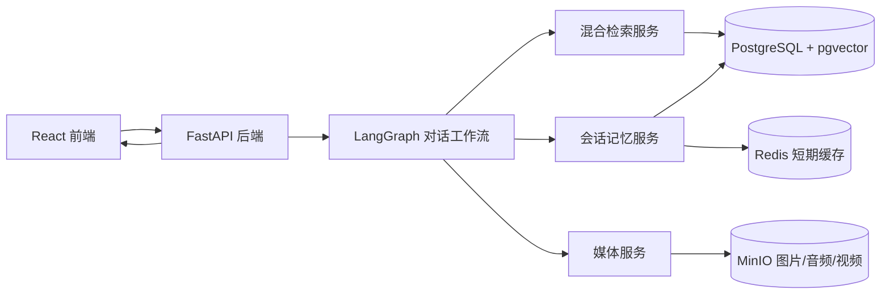

# 目标架构



## 数据职责

- PostgreSQL：用户、权限、文物、原始文档、父子 Chunk、向量、关键词索引、会话、消息、媒体元数据、审计记录。
- pgvector：PostgreSQL 内的扩展，用于向量相似度检索；不是另一套独立数据库。
- MinIO：只保存图片、音频、视频、原始附件等二进制文件。
- Redis：缓存最近会话、限流和短期状态；任何重要数据都必须可从 PostgreSQL 恢复。

## RAG 检索链路

1. 导入 Word，保存原始文档与清洗文本。
2. 生成父 Chunk 和更小的子 Chunk；子 Chunk 负责召回，父 Chunk 负责补足上下文。
3. 为子 Chunk 建立关键词和向量索引。
4. 查询时并行执行关键词检索与向量检索。
5. 使用 RRF 合并候选，再由 reranker 选出最终上下文。
6. 回答必须带来源 `document_id/chunk_id`，前端据此展示引用。

## 媒体访问规则

模型和前端都不能看到服务器磁盘路径。后端只返回媒体 ID 与短时有效 URL，例如：

```json
{
  "id": "media_01J...",
  "type": "video",
  "url": "https://api.example.com/api/v1/media/media_01J.../download"
}
```
